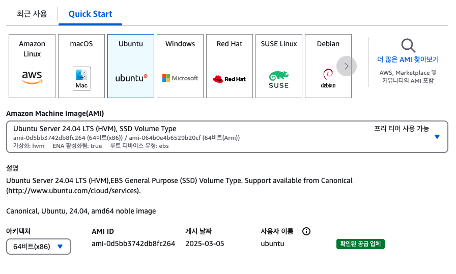
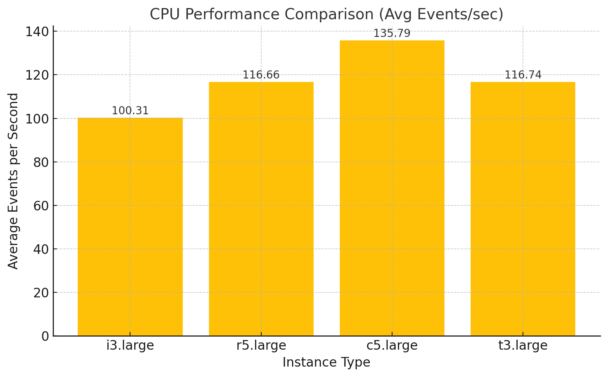
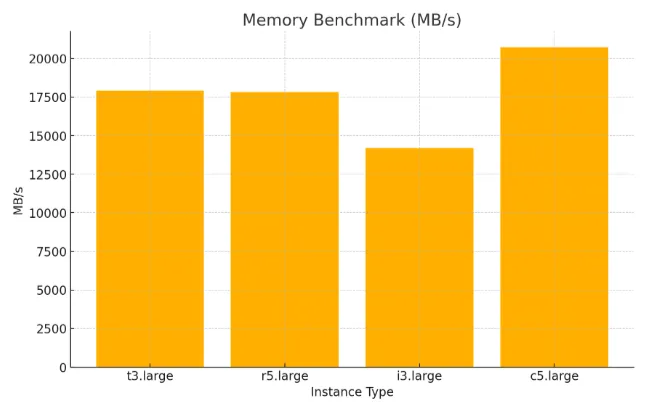
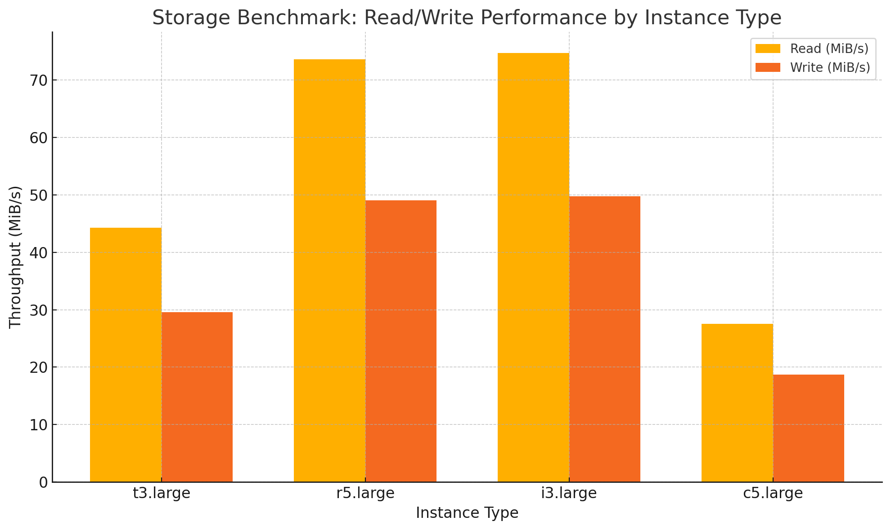
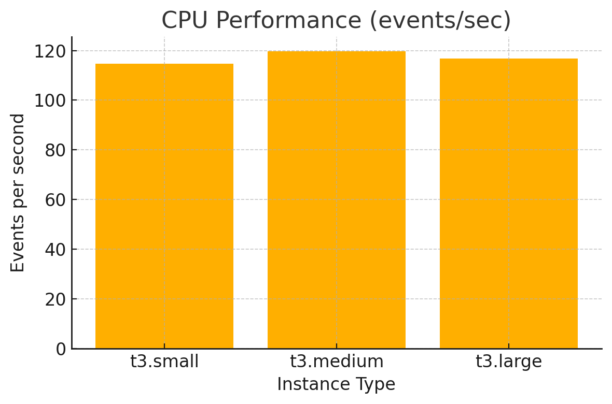
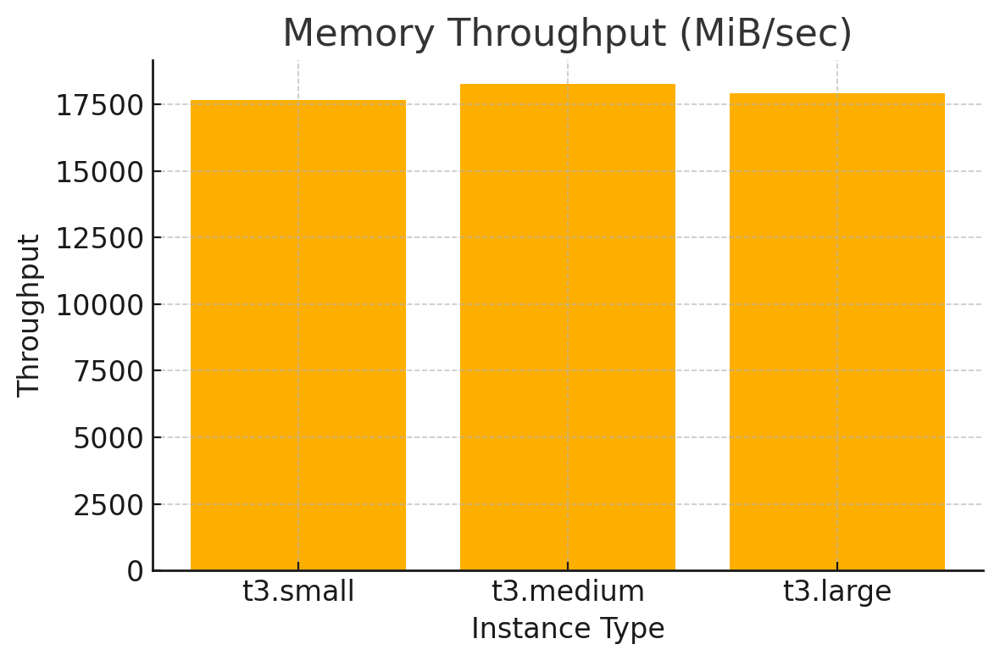
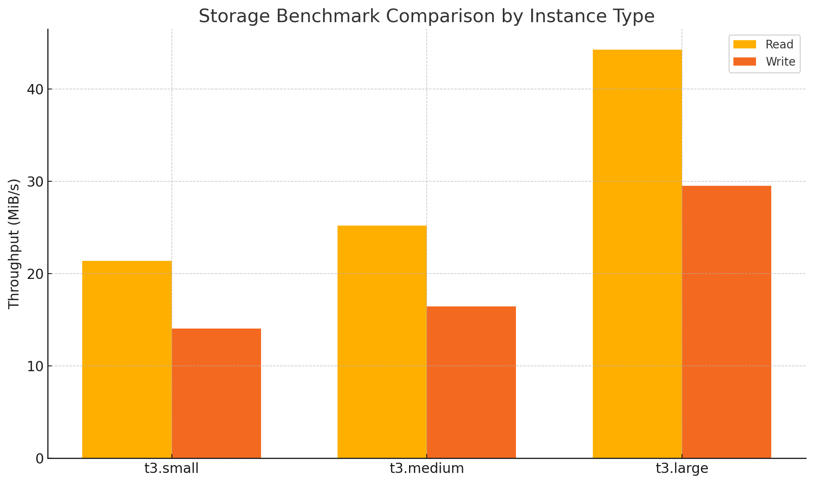
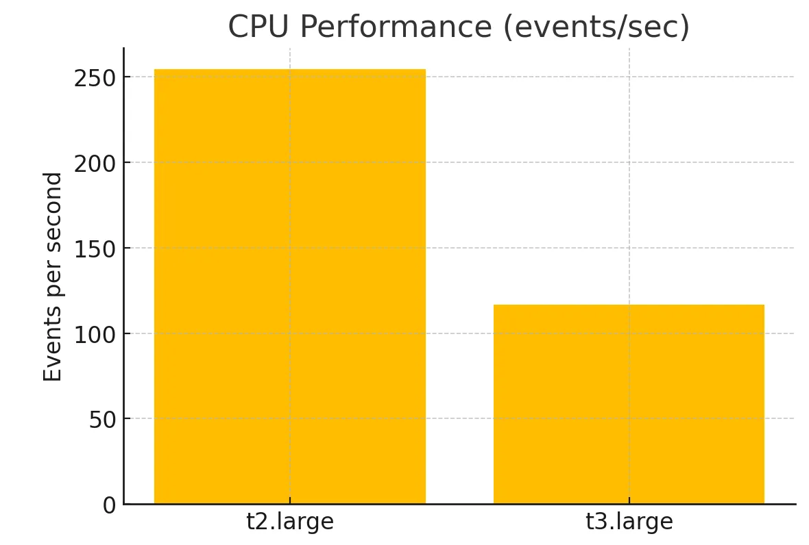
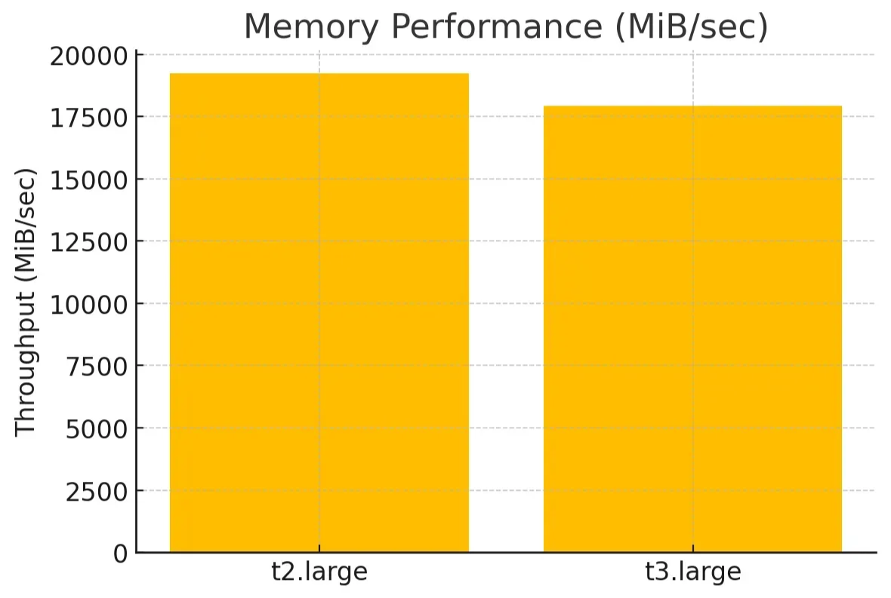
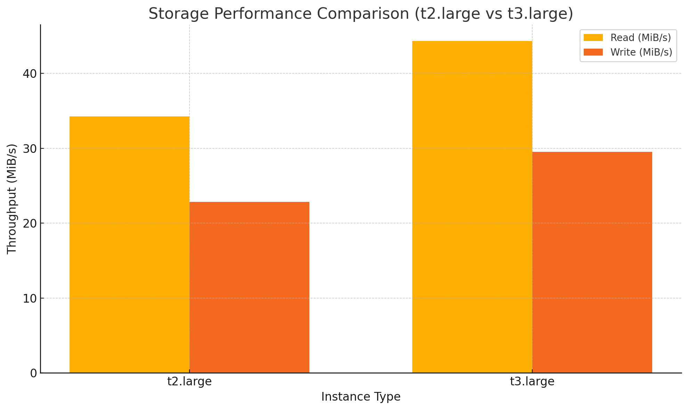

<h1>주제 : sysbench를 활용한 AWS 인스턴스 성능 평가</h1>
<h2>[AWS] EC2 인스턴스 성능 비교 리포트</h2>
<h3>TEAM 3.2.6(이광해, 이민주, 이지환)</h3>

# 1. 환경 설정

리전 선택 : 아시아 태평양(서울)

## 1.1. 인스턴스 유형 선정 기준

- **일반 목적 인스턴스 비교**: 동일한 인스턴스 계열 내에서 vCPU, RAM 등의 스펙이 증가함에 따라 성능이 어떻게 달라지는지 확인 (`t3.small`, `t3.medium`, `t3.large`)
- **세대 비교**: vCPU, RAM 스펙은 유사하지만 세대 차이가 있는 인스턴스 간 성능 차이 비교 (`t3.large` vs `t2.large`)
- **리소스 특화 인스턴스 비교**: CPU, 메모리, 저장소에 특화된 인스턴스를 직접 비교 (`c5.large`, `r5.large`, `i3.large`)

## 1.2. 선정한 AMI 및 아키텍처



## 1.3. 인스턴스 유형 설정

| 인스턴스 유형 | vCPU | 메모리(GB) | 저장소(GB) | 특화 유형     | 네트워크 성능    |
| ------------- | ---- | ---------- | ---------- | ------------- | ---------------- |
| i3.large      | 2    | 15.3       | 475 SSD    | 스토리지 특화 | Up to 10 Gigabit |
| c5.large      | 2    | 4          | -          | CPU 특화      | Up to 10 Gigabit |
| r5.large      | 2    | 16         | -          | RAM 특화      | Up to 10 Gigabit |
| t3.small      | 2    | 2          | -          | 일반 목적형   | Up to 5 Gigabit  |
| t3.medium     | 2    | 4          | -          | 일반 목적형   | Up to 5 Gigabit  |
| t3.large      | 2    | 8          | -          | 일반 목적형   | Up to 5 Gigabit  |
| t2.large      | 2    | 8          | -          | 이전 세대     | Low to Moderate  |

## 1.4. 테스트 시나리오

서버 컴퓨팅 성능 체크 시에 많이 사용하는 sysbench가 지원하는 cpu 벤치마크, 메모리 엑세스 벤치마크, 파일 시스템 레벨 벤치마크를 이용하여 서버 성능 비교를 진행했습니다.

### 1.4.1. sysbench

---

`sysbench`는 **LUA 스크립트를 활용하여 멀티 쓰레드 방식으로 벤치마킹을 수행하는 오픈소스 툴**입니다.

**MySQL 과 같은 데이터베이스 벤치마크에 가장 많이 사용**되지만 일반적인 테스트를 위해 데이터베이스 서버를 포함하지 않는 임의로 복잡한 워크로드를 만드는 데에도 사용할 수 있습니다. CPU, 메모리, I/O 및 데이터베이스 성능 테스트를 위한 테스트 기능을 갖춘 다목적 벤치마크입니다 .

### 1.4.2. 테스트 스크립트

---

### 전체 코드

```bash
#!/bin/bash

echo "========== CPU Benchmark =========="

for i in {1..3}; do
    echo "Run $i:"
    sysbench cpu --cpu-max-prime=50000 run | tee -a cpu_results.txt
    echo ""
done

echo "========== Memory Benchmark =========="

for i in {1..3}; do
    echo "Run $i:"
    sysbench memory --memory-block-size=1M --memory-total-size=10G run | tee -a memory_results.txt
    echo ""
done

echo "========== File I/O Benchmark =========="

for i in {1..3}; do
    echo "Run $i: prepare"
    sysbench fileio --file-total-size=10G --file-test-mode=rndrw --file-num=4 prepare

    echo "Run $i: run"
    sysbench fileio --file-total-size=10G --file-test-mode=rndrw --file-num=4 run | tee -a fileio_results.txt

    echo "Run $i: cleanup"
    sysbench fileio --file-total-size=10G --file-num=4 cleanup
    echo ""
done

echo "테스트 완료. 결과는 cpu_results.txt, memory_results.txt, fileio_results.txt에 저장됨"
```

### CPU Benchmark

---

```bash
sysbench cpu --cpu-max-prime=50000 run | tee -a cpu_results.txt
```

- `-cpu-max-prime=50000`: 1부터 50,000까지의 소수(prime number)를 계산 (부하량 조절)
  - 적당한 수준의 연산 부하를 유발
  - 너무 낮으면 성능 차이를 측정하기 어렵고, 너무 높으면 과도한 시간 소모가 발생
- 모든 인스턴스에 동일하게 적용 (CPU 연산 비교용)
- 해당 Benchmark를 3번 반복
  - 결과 값을 cpu_results.txt에 저장

### Memory Benchmark

---

```bash
sysbench memory --memory-block-size=1M --memory-total-size=10G run | tee -a memory_results.txt
```

- `memory`: 메모리 읽기/쓰기 속도 테스트
- `-memory-block-size=1M`: 한번에 처리하는 메모리 블록의 크기 (기본은 1K)
  - `1M`: 대용량 메모리 연산을 가정 (대부분의 실제 어플리케이션이 페이지 단위 메모리를 다룸)
  - 상대적으로 큰 1M로 설정해 I/O 효과 강조
- `-memory-total-size=10G`: 총 읽기/쓰기 수행할 데이터 양 (10GB)
  - `10G`: 총 작업량, 메모리 대역폭을 폭넓게 측정하기 위한 값
    - 대부분의 일반 인스턴스(`t3`, `m5`, `c5` 등)는 4~16GB RAM을 가짐
    - 따라서 실제 사용 가능한 메모리의 50~70% 범위 내에서 설정
- 해당 Benchmark를 3번 반복
  - 결과 값을 memory_results.txt에 저장

### File I/O Benchmark

---

```bash
sysbench fileio --file-total-size=10G --file-test-mode=rndrw --file-num=4 prepare

sysbench fileio --file-total-size=10G --file-test-mode=rndrw --file-num=4 run | tee -a fileio_results.txt

sysbench fileio --file-total-size=10G --file-num=4 cleanup
```

- `fileio`: 디스크 입출력 테스트 모듈
- `-file-total-size=10G`: 테스트에 사용할 총 파일 크기
  - `10G`: 테스트 파일의 총 용량
    - 작으면 디스크 캐시 효과로 인해 속도가 왜곡될 수 있고, 너무 크면 작은 디스크에서 성능 저하 및 비용 발생
  - 대부분 인스턴스에서 RAM보다 크도록 하여 디스크 I/O에 영향을 미침
- `-file-test-mode=seqrd`: sequential read (연속 읽기) 방식
  - 다른 옵션: `seqwr`, `rndrd`, `rndwr`, `rndrw`
- `prepare`: 테스트용 파일 생성
- `cleanup`: 생성된 테스트 파일 삭제
- 해당 Benchmark를 3번 반복
  - 결과 값을 fileio_results.txt에 저장

# 2. 실험 및 결과

## 2.1. 실험 결과 예측

### 2.1.1. 리소스 특화 인스턴스 비교

---

- **i3.large**: Storage 성능이 월등할 것으로 예상되며, 디스크 I/O 테스트에서 뛰어난 성능이 기대
- **c5.large**: CPU 연산 성능이 가장 뛰어날 것으로 예상
- **r5.large**: 메모리 관련 작업에서 빠른 속도 기대

### 2.1.2. 일반 목적 인스턴스 비교

---

- **t3 계열**: 계열 내에서 리소스 스펙에 따라 선형적인 성능 향상 예상

### 2.1.3 세대 비교

---

- **t2.large**: 구세대 인스턴스이므로 `t3.large` 대비 전반적인 성능 저하 예상

## 2.2. 실험 결과

<h3>2.2. 실험 결과</h3>

<table border="1" cellspacing="0" cellpadding="8">
  <thead>
    <tr>
      <th>Instance</th>
      <th>CPU 결과</th>
      <th>Memory 결과</th>
      <th>Storage 결과</th>
    </tr>
  </thead>
  <tbody>
    <tr>
      <td>t2.large</td>
      <td><a href="./results/t2.large/cpu.sh">cpu.sh</a></td>
      <td><a href="./results/t2.large/memory.sh">memory.sh</a></td>
      <td><a href="./results/t2.large/storage.sh">storage.sh</a></td>
    </tr>
    <tr>
      <td>t3.small</td>
      <td><a href="./results/t3.small/cpu.sh">cpu.sh</a></td>
      <td><a href="./results/t3.small/memory.sh">memory.sh</a></td>
      <td><a href="./results/t3.small/storage.sh">storage.sh</a></td>
    </tr>
    <tr>
      <td>t3.medium</td>
      <td><a href="./results/t3.medium/cpu.sh">cpu.sh</a></td>
      <td><a href="./results/t3.medium/memory.sh">memory.sh</a></td>
      <td><a href="./results/t3.medium/storage.sh">storage.sh</a></td>
    </tr>
    <tr>
      <td>t3.large</td>
      <td><a href="./results/t3.large/cpu.sh">cpu.sh</a></td>
      <td><a href="./results/t3.large/memory.sh">memory.sh</a></td>
      <td><a href="./results/t3.large/storage.sh">storage.sh</a></td>
    </tr>
    <tr>
      <td>r5.large</td>
      <td><a href="./results/r5.large/cpu.sh">cpu.sh</a></td>
      <td><a href="./results/r5.large/memory.sh">memory.sh</a></td>
      <td><a href="./results/r5.large/storage.sh">storage.sh</a></td>
    </tr>
    <tr>
      <td>i3.large</td>
      <td><a href="./results/i3.large/cpu.sh">cpu.sh</a></td>
      <td><a href="./results/i3.large/memory.sh">memory.sh</a></td>
      <td><a href="./results/i3.large/storage.sh">storage.sh</a></td>
    </tr>
    <tr>
      <td>c5.large</td>
      <td><a href="./results/c5.large/cpu.sh">cpu.sh</a></td>
      <td><a href="./results/c5.large/memory.sh">memory.sh</a></td>
      <td><a href="./results/c5.large/storage.sh">storage.sh</a></td>
    </tr>
  </tbody>
</table>

# 3. 결과 분석

## 3.1. 리소스 특화 인스턴스별 성능 비교 (`i3.large`, `c5.large`, `r5.large`, `t3.large`)

<div style="display: flex; justify-content: space-between; gap: 10px; margin-bottom: 1rem;">
  
  
  
</div>

### 3.1.1. CPU Benchmark 성능 비교 (CPU speed 비교)

---

`event per second` 값으로 CPU 성능 비교

<!--  -->

### 3.1.2. Memory enchmark 성능 비교 (메모리 쓰기 작업을 얼마나 빠르게 수행했는지 측정)

---

`MiB transferred (MiB/sec)`

<!--  -->

### 3.1.3. Storage enchmark 성능 비교 (디스크 입출력 속도 측정)

---

`read/write Throughput (MiB/sec)` 지표를 기준으로 각 인스턴스의 디스크 I/O 처리 속도를 비교하였다.

<!--  -->

### **3.1.4. 성능 비교 분석**

---

| **인스턴스 유형** | **CPU (Events/sec)** | **Memory (MB/s)** | **Read Throughput(MiB/s)** | **Write Throughput (MiB/s)** |
| ----------------- | -------------------- | ----------------- | -------------------------- | ---------------------------- |
| **t3.large**      | 116.74               | 17,925.92         | 44.3                       | 29.61                        |
| **r5.large**      | 116.66               | 17,827.48         | 73.63                      | 49.07                        |
| **i3.large**      | 100.31               | 14,208.60         | 74.68                      | 49.79                        |
| **c5.large**      | 135.79               | 20,716.85         | 27.58                      | 18.72                        |

### **3.1.5. 분석 결과**

---

**CPU 성능**

- **가장 우수:** `c5.large` (135.79 events/sec)
- `t3.large`, `r5.large`는 거의 동등한 성능
- `i3.large`는 다른 인스턴스에 비해 낮음 (100.31)

**Memory 성능**

- **가장 우수:** `c5.large` (20,716 MB/s)
- `t3.large` 및 `r5.large`는 유사 (약 17,800 MB/s)
- `i3.large`는 가장 낮음 (14,208 MB/s)

> r5.large는 메모리 최적화 인스턴스인데, c5.large보다 낮게 측정된 이유는 테스트 방식이 쓰기(write) 중심이라 IO 버스 구조 영향을 더 받았을 수 있습니다.

**Storage 성능**

- **가장 우수:** `i3.large`, `r5.large` (둘 다 120MB/s 이상)
- **가장 낮음:** `c5.large` (45.97 MB/s) → SSD IO 최적화가 덜 된 일반 EBS 기반 예상
- `i3.large`는 NVMe SSD 기반으로, 스토리지 성능에서 강세

### **3.1.6. 총평**

---

- **CPU/Memory 중심 연산**: `c5.large` 선택 권장
- **스토리지 중심 워크로드**: `i3.large` 또는 `r5.large` 추천
- **밸런스가 필요한 경우**: `t3.large`는 저렴하면서 무난한 성능

## 3.2. T3 계열 인스턴스 스케일별 성능 비교 (`t3.small`, `t3.medium`, `t3.large`)

<div style="display: flex; justify-content: space-between; gap: 10px; margin-bottom: 1rem;">
  
  
  
</div>

### 3.2.1. CPU Benchmark 성능 비교 (CPU speed 비교)

---

`event per second` 값으로 CPU 성능 비교

<!--  -->

### 3.2.2. Memory enchmark 성능 비교 (메모리 쓰기 작업을 얼마나 빠르게 수행했는지 측정)

---

`MiB transferred (MiB/sec)`

<!--  -->

### 3.2.3. Storage enchmark 성능 비교 (디스크 입출력 속도 측정)

---

`read/write Throughput (MiB/sec)` 지표를 기준으로 각 인스턴스의 디스크 I/O 처리 속도를 비교하였다.

<!--  -->

### **3.2.4. 성능 비교 분석**

---

| **Instance Type** | **CPU (Events/sec)** | **Memory (MB/s)** | **Read Throughput(MiB/s)** | **Write Throughput (MiB/s)** |
| ----------------- | -------------------- | ----------------- | -------------------------- | ---------------------------- |
| t3.small          | 114.37               | 17599.12          | 21.41                      | 14.05                        |
| t3.medium         | 119.62               | 18253.2           | 25.2                       | 16.47                        |
| t3.large          | 116.74               | 17925.92          | 44.3                       | 29.53                        |

### **3.2.5. 분석 결과**

---

**CPU 성능**

- **가장 우수**: `t3.medium` (119.62 events/sec)
- `t3.large`, `t3.small`은 유사한 성능 (약 114~116 events/sec)
- 성능 차이는 vCPU 수보다는 Burstable 특성에 따른 일시적 변동 가능성

**Memory 성능**

- **모든 인스턴스에서 유사** (17,500 ~ 18,200 MB/s)
- **원인 분석**:
  1. T3 계열은 공통적으로 **Up to 5Gbps 네트워크**, 동일 메모리 타입 사용
  2. `sysbench` 테스트는 block size 1MB, 총 10GB 기준의 **단순 쓰기 작업**으로, 인스턴스 스펙 간 차이를 구분하기엔 부족함
  3. 테스트는 기본적으로 **단일 스레드** 방식으로 작동 → vCPU 수에 영향 없음

**Storage 성능**

- **가장 우수**: `t3.large` (44.3 MiB/s read, 29.53 MiB/s write)
- `t3.medium`은 중간 (25.2 / 16.47), `t3.small`은 가장 낮음 (21.41 / 14.05)
- 디스크 I/O 성능은 인스턴스 크기(vCPU, EBS bandwidth 등)에 비례

### **3.2.6. 총평**

---

- **비용 대비 성능 효율**: `t3.medium`이 가장 안정적인 CPU 성능
- **I/O 처리량 우선 시**: `t3.large`가 명확한 우위 (디스크 처리량 기준)
- **저가 테스트/학습 목적**: `t3.small`도 메모리 성능에서는 큰 차이 없음

## 3.3. T2 vs T3 인스턴스 세대별별 성능 비교 (`t3.large` vs `t2.large`)

<div style="display: flex; justify-content: space-between; gap: 10px; margin-bottom: 1rem;">
  
  
  
</div>

### 3.3.1. CPU Benchmark 성능 비교 (CPU speed 비교)

---

`event per second` 값으로 CPU 성능 비교

<!--  -->

### 3.3.2. Memory enchmark 성능 비교 (메모리 쓰기 작업을 얼마나 빠르게 수행했는지 측정)

---

`MiB transferred (MiB/sec)`

<!--  -->

### 3.3.3. Storage enchmark 성능 비교 (디스크 입출력 속도 측정)

---

`read/write Throughput (MiB/sec)` 지표를 기준으로 각 인스턴스의 디스크 I/O 처리 속도를 비교하였다.

<!--  -->

### **3.3.4. 성능 비교 분석**

---

| **Instance Type** | **CPU (Events/sec)** | **Memory (MiB/sec)** | **Storage Read (MiB/sec)** | **Storage Write (MiB/sec)** |
| ----------------- | -------------------- | -------------------- | -------------------------- | --------------------------- |
| t2.large          | 254.27               | 19216.24             | 34.26                      | 22.84                       |
| t3.large          | 116.74               | 17925.92             | 44.3                       | 29.53                       |

### 3.3.5 분석 결과

---

- **CPU 성능**
  → `t2.large`는 약 254 events/sec로, `t3.large` 대비 **2배 이상의 처리 성능**
  → 이는 `t2`의 CPU burst 모델이 짧은 구간에 높은 성능을 제공하기 때문
- **Memory 처리량**
  → 두 인스턴스 모두 **약 17~19GiB/s**로 유사한 수준
  → 테스트는 write 중심이고, 기본 설정은 메모리 대역폭 차이를 드러내기 어려움
- **Storage 성능**
  → `t3.large`가 읽기/쓰기 모두에서 **우수한 성능**을 보임
  → `t3` 세대에서 EBS I/O 성능 개선이 이루어진 것으로 추정

### **3.3.6. 총평**

---

- Burst가 필요한 짧은 CPU 집약적 작업에는 t2.large
- 지속적 워크로드 또는 디스크 I/O 중심 작업에는 t3.large가 더 합리적임


# 4. 결론

## **4.1. 인스턴스 유형별 최적화 목적과 실제 성능의 일치 여부**

이번 실험은 AWS EC2 인스턴스를 유형별로 나누어 (컴퓨팅 최적화, 메모리 최적화, 스토리지 최적화, 범용형) 각기 다른 벤치마크 항목(CPU, Memory, Storage)에 대해 `sysbench`로 테스트를 수행하고, **실제 성능이 AWS의 인스턴스 설계 철학과 얼마나 부합하는지를 확인하는 데 목적**을 두었습니다.

<table border="1" cellspacing="0" cellpadding="8">
  <thead>
    <tr>
      <th>실험 결과</th>
    </tr>
  </thead>
  <tbody>
    <tr>
      <td>
        • <strong>CPU/Memory 중심 연산</strong>: <code>c5.large</code> 선택 권장<br>
        • <strong>스토리지 중심 워크로드</strong>: <code>i3.large</code> 또는 <code>r5.large</code> 추천<br>
        • <strong>밸런스가 필요한 경우</strong>: <code>t3.large</code>는 저렴하면서 무난한 성능
      </td>
    </tr>
    <tr>
      <td>
        • <strong>비용 대비 성능 효율</strong>: <code>t3.medium</code>이 가장 안정적인 CPU 성능<br>
        • <strong>I/O 처리량 우선 시</strong>: <code>t3.large</code>가 명확한 우위 (디스크 처리량 기준)<br>
        • <strong>저가 테스트/학습 목적</strong>: <code>t3.small</code>도 메모리 성능에서는 큰 차이 없음
      </td>
    </tr>
    <tr>
      <td>
        • Burst가 필요한 짧은 CPU 집약적 작업에는 <code>t2.large</code>이 가장 적절한 선택<br>
        • 지속적 워크로드 또는 디스크 I/O 중심 작업에는 <code>t3.large</code>가 우수한 성능을 발휘<br>
      </td>
    </tr>
  </tbody>
</table>

### 4.1.1 **컴퓨팅 최적화 인스턴스: `c5.large`**

---

- **CPU 성능** 측정 결과 모든 인스턴스 중 가장 우수 (약 135 events/sec)
- 단일 스레드 CPU 연산에서는 기대만큼의 성능을 보여줌
- 메모리/스토리지는 보통 수준
- **AWS의 “컴퓨팅 최적화” 분류와 실제 성능 일치**

### 4.1.2. **메모리 최적화 인스턴스: `r5.large`**

---

- 기대와 달리 `c5.large`, `t3.large`와 **비슷한 메모리 성능**
- 원인 분석:
  - `sysbench` memory 테스트는 **단일 스레드 + write 중심**으로,
    - `r5.large`의 **멀티채널 DDR4 + NUMA 최적화 구조**를 반영하지 못함
  - 실전용 워크로드(예: in-memory DB, GC-intensive Java 앱)에서의 장점이 반영되지 않음
- **테스트 방식의 한계로 실제 설계 목적 대비 낮은 성능으로 보임**

---

### 4.1.3. **스토리지 최적화 인스턴스: `i3.large`**

---

- 스토리지 throughput이 압도적으로 높음 (약 120~150 MiB/s)
- 이는 **NVMe 기반 로컬 디스크 구조의 강점**이 반영된 결과
- CPU/Memory는 평범하지만, **I/O 워크로드 특화**에 부합
- **AWS 설계 목적과 정확히 일치**

### 4.1.4. **범용형 인스턴스 (`t3.small`~`t3.large`)**

---

- **CPU, Memory 성능은 안정적이며 적절한 가격 대비 성능 제공**
- 스토리지 성능은 인스턴스 크기 증가에 따라 비례적으로 상승 (`t3.large`는 44 MiB/s로 매우 우수)
- `t3.small`, `t3.medium`, `t3.large` 간 **메모리 성능은 큰 차이 없음**
  - 이유:
    - 동일한 메모리 구조와 네트워크 대역폭
    - 메모리 테스트가 단순하여 차이를 부각시키지 못함
- **범용 목적이라는 설계 의도와 성능이 잘 부합**

### 4.1.5. **세대 비교 (`t2.large` vs `t3.large`)**

---

- `t2.large`는 CPU burst 특성으로 **짧은 시간 높은 CPU 성능** (254 events/sec)
- 그러나 지속적인 작업에서는 `t3.large`의 **스토리지 I/O 및 균형 성능**이 더 뛰어남
- **각 세대의 성능 철학이 다름: t2는 peak 중심, t3는 지속적 처리 기반**

## **4.2. 설계 목적과 실측 성능 일치 여부**

| **인스턴스 유형** | **설계 목적**          | **실제 성능 반영 여부** | **메모**                                    |
| ----------------- | ---------------------- | ----------------------- | ------------------------------------------- |
| `c5.large`        | 컴퓨팅 최적화          | 일치                    | CPU 성능 최고                               |
| `r5.large`        | 메모리 최적화          | 제한적                  | write 중심 테스트로 메모리 최적화 반영 부족 |
| `i3.large`        | 스토리지 최적화        | 일치                    | NVMe 디스크 성능 우수                       |
| `t3 계열`         | 범용형 (비용대비 균형) | 일치                    | 무난한 성능, 가격 대비 효율                 |
| `t2.large`        | 구세대 범용형          | 일시적 burst 성능       | 지속성은 떨어짐                             |

## **4.3. 최종 결론**

이번 실험을 통해 **AWS EC2 인스턴스 유형별로 설계 목적과 실제 성능이 대체로 부합함**을 확인할 수 있었으며, 특히 **스토리지, 컴퓨팅, 범용형 계열에서는 실측 수치가 설계 목적을 잘 반영**했습니다.

다만, **메모리 최적화 인스턴스(r5)의 성능이 기대에 못 미친 이유는 테스트 방식의 단순성**에 있으며, 실제 애플리케이션 환경(다중 스레드, 긴 실행 시간, 다양한 접근 패턴 등)에서는 다르게 나타날 가능성이 큽니다.
